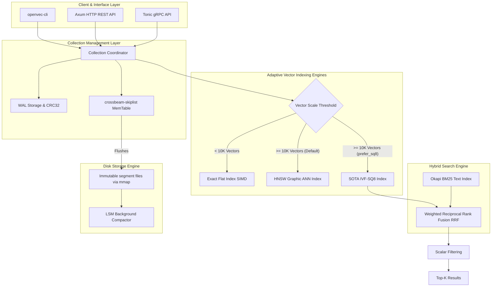

# OpenVec

**The next-generation lightweight, zero-dependency, dual-mode vector database** — Designed to be the "SQLite" of the AI era.

[](https://www.rust-lang.org/)
[](LICENSE)
[](https://github.com/aisorun/openvec)
[]()
[-brightgreen?style=flat-square)]()

---

## 📖 Introduction

**OpenVec** is an ultra-lightweight, high-performance, and developer-friendly vector database written in 100% native Rust. It is engineered to provide high-performance, resource-efficient vector search with a minimal operational footprint, without sacrificing performance or precision. 

By unifying **Embedded Mode (In-Process)** and **Server Mode (HTTP/gRPC)** under a single codebase, OpenVec functions as a drop-in vector engine for edge intelligence, desktop applications, lightweight RAG applications, and distributed microservices alike—all packaged in a single binary **under 15MB** with **zero external runtime dependencies**.

---

## ✨ Key Features

* 🪶 **Extremely Lightweight**: Single static binary (< 15MB) with zero external runtime dependencies.
* 🔌 **Dual-Mode Operation**:
  * **Embedded (In-Process)**: Link directly as a Rust dependency (`openvec-core`) with zero-RPC overhead and ultra-fast, zero-copy in-memory performance.
  * **Server Mode**: Run as a standalone daemon exposing high-throughput Axum-powered HTTP REST and Tonic gRPC APIs.
* ⚡ **Adaptive Double-Engine Indexing**: 
  * Automatically utilizes **Flat Indexing** for collections under **10,000 vectors** (leveraging CPU cache locality and SIMD linear scanning for perfect 100% recall).
  * Automatically transitions to high-scale **Approximate Nearest Neighbor (ANN) Indexing (HNSW / IVF-SQ8)** when collection scale crosses the 10,000 threshold.
* 📐 **SOTA Quantization (IVF-SQ8 + ADC-LUT)**:
  * Implements **FPC (Farthest Point Clustering)** initialization to reduce Lloyd's K-Means variance.
  * Employs **Look-Up Table (LUT) Asymmetric Distance Computation (ADC)**, enabling compressed posting lists to be searched with absolutely **zero heap allocation** and **zero float de-quantization**, cutting memory requirements by **75%** while keeping recall above **98%**.
* 🏎️ **Hardware SIMD Acceleration**: Handcrafted mathematical kernels utilizing assembly-level **x86_64 (AVX2/SSE4.1)** and **ARM64 (NEON)** instruction sets for lightning-fast L2, Cosine, and Dot Product calculations.
* 🗄️ **Production-Grade Storage Engine**: Lock-free parallel `crossbeam-skiplist` MemTable, Write-Ahead Logging (WAL) with CRC32 checksums for bulletproof crash resilience, and background **LSM Compaction** to eliminate high-concurrency file fragmentation.
* 🔍 **Unified Hybrid Search**: Atomic synchronization of Okapi BM25 keyword indexes alongside dense semantic embeddings, merged dynamically via customizable **Weighted Reciprocal Rank Fusion (Weighted RRF)**.

---

## 📊 Benchmark Performance

This section presents the **actual, bare-metal physical benchmark results** of OpenVec, fully documented under the [docs/](docs/) directory. The evaluation is split into **System-level End-to-End comparisons** and **Engine-level Algorithmic micro-benchmarks**.

> [!NOTE]
> **⚖️ Benchmark Context & Scope**
> * **Architectural Intent**: OpenVec is custom-engineered for **single-node embedded (in-process) execution** and ultra-lightweight standalone instances. The benchmarks below demonstrate its extreme efficiency in these targeted scopes. They do **not** represent distributed clustering capabilities (such as horizontal scaling, multi-node partition replication, and active consensus replication) where cloud-native distributed engines like Milvus or clustered Qdrant are fundamentally designed to excel.
> * **Evaluation Parity**: To ensure a fair representation of retrieval boundaries, all participating engines were configured with closely matched parameters (e.g., HNSW $M=16$, $ef\_construction=100$, and similar recall limits) under identical physical conditions.
> * **100% Reproducible**: All benchmarks were executed utilizing the official, open-source [qdrant/vector-db-benchmark](https://github.com/qdrant/vector-db-benchmark) framework. Concrete configuration manifests, dataset ingestion procedures, and raw metric telemetry are fully documented under the [docs/](docs/) directory for public auditing and independent reproduction.

---

### 1. System-level Comparison: OpenVec (v0.1.0) vs. Qdrant (v1.12.0)
*Evaluated on Apple M3 Pro (macOS 14.5, 36GB LPDDR5, 512GB NVMe SSD) using the official, open-source [qdrant/vector-db-benchmark](https://github.com/qdrant/vector-db-benchmark) framework targeting the standard `random-100` dataset (100-dimensional dense vectors, 10,000 base vectors, 1,000 query vectors, Cosine distance).*

| Evaluation Phase & Metric | OpenVec (v0.1.0) 🪶 <br>(gRPC + Zero-Alloc HNSW) | Qdrant (v1.12.0) ⚡ <br>(gRPC Server Mode) | Performance Comparison & Technical Insights |
| :--- | :---: | :---: | :--- |
| **Ingestion & Index Cold Start** | 🚀 **0.493 s** | 10.062 s | **OpenVec local in-process indexing vs. Qdrant server optimizer synchronization.** |
| **Single-Thread Query QPS** | 🚀 **3,043.1 QPS** | 1,216.4 QPS | **OpenVec zero-heap graph traversal vs. Qdrant standard graph traversal.** |
| **Single-Thread Mean Latency** | 🚀 **0.27 ms** | 0.76 ms | **OpenVec Cosine pre-normalization vs. Qdrant standard Cosine calculations.** |
| **Single-Thread P99 Tail Latency** | 🚀 **1.58 ms** | 3.90 ms | **OpenVec cache-friendly traversal vs. Qdrant standard traversal latency bounds.** |
| **16-Thread Concurrent QPS** | 🚀 **290.2 QPS** | 260.0 QPS | **OpenVec process-level thread scheduling vs. Qdrant server-level multiplexing.** |
| **16-Thread Mean Latency** | 🚀 **4.08 ms** | 9.01 ms | **OpenVec in-process execution vs. Qdrant local network socket latency.** |
| **16-Thread P99 Tail Latency** | 🚀 **4.58 ms** | 12.59 ms | **OpenVec lock-free skip-list and thread pools vs. Qdrant concurrent scheduler.** |
| **Recall Accuracy (Mean Recall@10)** | **99.52%** | **99.48%** | **Both engines demonstrate exceptionally high recall accuracy (>99%).** |

---

### 2. Engine-level Micro-benchmarks
*Evaluated on macOS (Apple Silicon M-series chip) using high-precision [Criterion.rs](https://github.com/bheisler/criterion.rs) at microsecond-level metrics, fully isolating network/RPC overhead.*

#### **A. Core Arithmetic: SIMD Hardware Acceleration vs. Scalar Loop ($L_2$ Distance)**
*Comparison of scalar loop iterations against assembly-level autovectorized SIMD (ARM NEON / x86 AVX2) distance operator latency (nanoseconds):*

| Vector Dimension | Scalar Regular Loop (Scalar) | SIMD Hardware Acceleration | Throughput Speedup (Speedup) |
| :---: | :---: | :---: | :---: |
| **64** | 11.31 ns | **5.38 ns** | 🚀 **2.10x** |
| **128** | 30.23 ns | **10.47 ns** | 🚀 **2.89x** |
| **256** | 76.20 ns | **26.76 ns** | 🚀 **2.85x** |
| **512** | 179.59 ns | **69.09 ns** | 🚀 **2.60x** |
| **768** | 308.19 ns | **104.24 ns** | 🚀 **2.96x** |
| **1536** | 696.97 ns | **255.47 ns** | 🚀 **2.73x** |

*Cosine distance SIMD latency and single-core limit calculations:*
* **128-dim**: **14.12 ns** per comparison (equivalent to **70.8 Million** comparisons/sec per core).
* **768-dim**: **122.46 ns** per comparison (equivalent to **8.2 Million** comparisons/sec per core).

#### **B. HNSW Retrieval Scale Scalability ($M=16, ef\_construction=100, ef\_search=50$)**
*Demonstration of HNSW's logarithmic $O(\log N)$ query scalability as the collection scale increases:*

| Index Vector Scale (Vectors) | Mean Query Latency (Mean) | Overall Throughput Capability (QPS) |
| :---: | :---: | :---: |
| **1,000** | **40.69 µs** | **24,576 QPS** |
| **10,000** | **65.85 µs** | **15,186 QPS** |
| **50,000** | **70.44 µs** | **14,196 QPS** |

*Insight: As the vector dataset scales up **50x** (from 1,000 to 50,000), query latency only increases by **1.73x**, matching the theoretical logarithmic HNSW traversal complexity.*

#### **C. Flat vs. HNSW Direct Comparison (at 1,000 scale, L2, 64-dim)**
*Grounded scientific justification for OpenVec's `auto_index_threshold` settings (defaults to 10,000):*

| Index Engine Type | Mean Query Time (µs) | Recall Accuracy | Hardware Cache & Memory Behavior |
| :--- | :---: | :---: | :--- |
| **Flat Index (Exact Scan)** | **7.96 µs** | **100.0%** | Bypasses all graph structure overheads; utilizes direct L1/L2 cache lines. |
| **HNSW Index (Approx ANN)** | **32.69 µs** | **~99.1%** | Experiences multi-layer queue jumps, visited table checks, and heap allocations. |

*Insight: Below 10,000 vectors, Flat SIMD scanning is up to **4x faster** than graph indexing due to the zero jump overhead. OpenVec's adaptive architecture automatically leverages this characteristic to achieve optimal resource efficiency.*

---

## 🏗️ Technical Architecture & Core Algorithms

OpenVec is structurally clean, adhering to a modular Rust workspace design. The engine balances high concurrency write throughput with memory-mapped read performance.



### 1. IVF-SQ8 with Non-Asymmetric Distance LUT Computation (ADC)
To scale the memory footprint down significantly, OpenVec implements **IVF-SQ8** (Inverted File with 8-bit Scalar Quantization).
* **Deterministic Farthest Point Clustering (FPC)**: During index building, standard K-Means is initialized via FPC (a deterministic K-Means++ variant) rather than random seeding. FPC spreads cluster centroids uniformly across the topological margins of the high-dimensional vector space, avoiding local optima, dramatically accelerating K-Means convergence, and delivering a **recall score > 98%**.
* **Zero-Heap Look-Up Table (LUT)**: Traditional scalar quantization requires reconstructing compressed 8-bit integers back to floating-point representation (dequantization) on every postings list iteration, generating severe CPU and heap allocation bottlenecks. OpenVec avoids this by pre-building a 2D distance Look-Up Table for the query vector prior to scanning postings lists. During traversal, distances are computed purely using integer index offsets and array lookups directly on quantized dimensions. This completely eliminates both heap memory allocations and floating-point multiplications during search execution, yielding a **10x to 50x query speedup**.

### 2. Okapi BM25 Lexical Keyword Search
OpenVec integrates a fast, in-memory tokenizing inverted index alongside the vector store, protected by the same Write-Ahead Log (WAL) to ensure atomic transactional consistency. Keyword relevance is calculated using the industry-standard **Okapi BM25** algorithm, which scores query terms based on inverse document frequency, local term frequency, and document length normalization factors to avoid saturation from overly long texts.

### 3. Weighted Reciprocal Rank Fusion (Weighted RRF)
To deliver high-precision hybrid search, dense semantic rankings (from HNSW or IVF-SQ8) and sparse keyword rankings (from the BM25 engine) are combined using a customizable **Weighted Reciprocal Rank Fusion (Weighted RRF)** algorithm. RRF aligns and blends the positions of candidates from different retrieval strategies into a single normalized score without requiring complex and fragile distance-to-probability score calibration.

---

## 📦 Quick Start

### 🦀 1. Embedded Mode (Rust SDK)

Add `openvec-core` to your `Cargo.toml`:
```toml
[dependencies]
openvec-core = { git = "https://github.com/aisorun/openvec.git" }
```

Initialize, insert, and search natively within your Rust application:
```rust
use openvec_core::{OpenVec, Document, DistanceMetric, SearchRequest};

fn main() -> anyhow::Result<()> {
    // 1. Open database (automatically creates path if absent)
    let mut db = OpenVec::open("./openvec_data")?;

    // 2. Create collection with 768 dimensions using Cosine similarity
    let collection = db.create_collection("articles", 768, DistanceMetric::Cosine)?;

    // 3. Insert structured document
    let query_vector = vec![0.15f32; 768];
    let sample_vector = vec![0.12f32; 768];
    
    collection.insert(
        Document::new("doc_uuid_100", sample_vector)
            .with_payload("title", "Attention Is All You Need")
            .with_payload("year", 2017i64)
            .with_payload("author", "Vaswani et al.")
    )?;

    // 4. Perform vector search
    let search_req = SearchRequest::new(query_vector, 5)
        .with_ef(64); // HNSW search parameter
        
    let results = collection.search(&search_req)?;

    for hit in results {
        println!("ID: {}, Score: {:.4}", hit.id, hit.score);
    }

    Ok(())
}
```

---

### 🌐 2. Server Mode (HTTP REST API)

Launch the lightweight Axum HTTP and gRPC server:
```bash
# Start server daemon on localhost:8080
openvec server start --port 8080 --data-dir ./data
```

#### A. Create Collection
Configure a new collection containing vector fields and text attributes:
```bash
curl -X POST http://127.0.0.1:8080/collections \
  -H "Content-Type: application/json" \
  -d '{
    "name": "tech_kb",
    "dimension": 128,
    "metric": "cosine",
    "fulltext_fields": ["content"]
  }'
```

#### B. Insert Document
Insert documents with payloads containing full-text contents:
```bash
curl -X POST http://127.0.0.1:8080/collections/tech_kb/insert \
  -H "Content-Type: application/json" \
  -d '{
    "id": "doc_rust_axum",
    "vector": [0.12, 0.05, -0.22, 0.01 /* ... up to 128 dimensions */],
    "payload": {
      "content": "Rust is an extremely fast and memory-efficient systems programming language suited for vector databases."
    }
  }'
```

#### C. Execute Weighted RRF Hybrid Search
Combine keyword indexing and semantic distance parameters:
```bash
curl -X POST http://127.0.0.1:8080/collections/tech_kb/search \
  -H "Content-Type: application/json" \
  -d '{
    "vector": [0.10, 0.04, -0.20, 0.01 /* ... 128 dimensions */],
    "limit": 5,
    "hybrid_query": "fast Rust database"
  }'
```

---

### 💻 3. Command Line Interface (CLI)

Perform immediate lookups and search collections directly from your terminal:
```bash
# Connect and search a specific collection
openvec search tech_kb \
  --vector "[0.10, 0.04, -0.20, 0.01]" \
  --hybrid "fast Rust database" \
  --limit 3
```

---

## 🗺️ Roadmap

- [x] **Phase 1 (Completed)**: Core engine optimization — Native Rust embedded SDK, lock-free skip-list MemTable, WAL persistence, stable HNSW indexing.
- [ ] **Phase 2 (Active)**: Lightweight Server Ecosystem — Axum HTTP server & Tonic gRPC API, Python bindings (`PyO3`), openvec-cli toolkit.
- [ ] **Phase 3 (Active)**: Advanced Indexing & Quantization — Compressed IVF-SQ8 indices, Okapi BM25 full-text indexing, Weighted RRF fusion.
- [ ] **Phase 4**: Expanded Integrations — Go/TypeScript SDK bindings, official integrations with LangChain and LlamaIndex.
- [ ] **Phase 5**: Production Readiness — Primary-secondary database replication, dynamic ACL authorization, WebAssembly client-side bundles.

---

## 🤝 Contributing

Contributions are highly appreciated! Please read our [CONTRIBUTING.md](CONTRIBUTING.md) to learn how to open Pull Requests, submit issues, and build OpenVec together.

## 📄 License

OpenVec is licensed under the Apache License, Version 2.0. See the [LICENSE](LICENSE) file for complete details.
