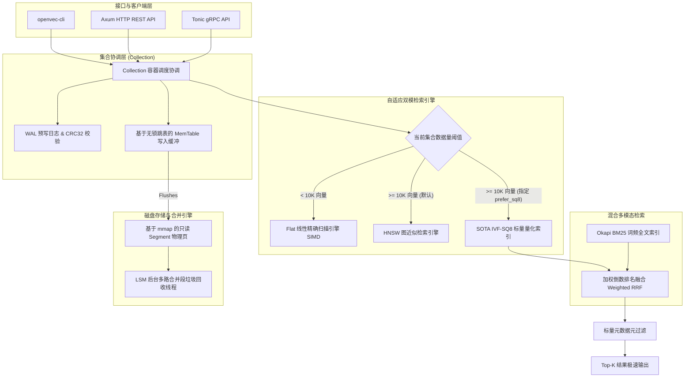

# OpenVec

**下一代轻量级、零依赖、双模向量数据库** —— 致力于成为 AI 时代的 "SQLite"。

🇺🇸 [English](README.md) | 🇨🇳 [简体中文](README_ZH.md)

[](https://www.rust-lang.org/)
[](LICENSE)
[](https://github.com/aisorun/openvec)
[]()
[-brightgreen?style=flat-square)]()

---

## 📖 简介

**OpenVec** 是一款完全采用原生 Rust 开发的超轻量、高性能、对开发者极其友好的向量数据库。它专为提供高性能、高能效的向量检索而设计，旨在实现极低的原生运维开销，在保证极高检索精度与吞吐速率的前提下，实现了极致的资源利用效率。

通过在单一代码库中完美统一 **Embedded Mode（进程内嵌入式）** 与 **Server Mode（HTTP/gRPC 服务端模式）**，OpenVec 可以无缝打包部署于端侧智能设备、桌面级软件应用、轻量化 RAG（检索增强生成）知识库以及分布式微服务集群中——所有这一切都包含在**小于 15MB 的单二进制文件**中，且**无任何外部运行依赖**。

---

## ✨ 核心特性

* 🪶 **极致轻量**：单静态二进制文件（< 15MB），零外部运行时依赖。
* 🔌 **双模运行**：
  * **嵌入式模式 (Embedded)**：可直接作为 Rust 依赖包（`openvec-core`）引入您的宿主进程，共享同一块内存空间，完全免除网络 RPC 序列化开销，实现极致的进程内零拷贝极速读写。
  * **独立服务端模式 (Server)**：单行命令即可拉起独立服务守护进程，暴露基于 Axum 框架的高并发 HTTP REST API 以及 Tonic 高性能 gRPC 接口。
* ⚡ **自适应双索引引擎**：
  * 当单集合（Collection）数据量在 **10,000 条以下**时，自动采用 **Flat 精确扫描索引**（利用 CPU L1/L2 缓存线局部性与手写 SIMD 线性扫描，在极速耗时下确保 100% 召回率）。
  * 当数据规模跨越 **10,000 条**临界线后，自动平滑升级为高效的 **近似最近邻（ANN）图检索索引 (HNSW / IVF-SQ8)**。
* 📐 **前沿量化压缩 (IVF-SQ8 + ADC-LUT)**：
  * 引入**确定性最远点聚类 (FPC) 算法**进行质心初始化，大幅降低 Lloyd's K-Means 聚类方差，确保 postings list 划分的最优流形拓扑边界。
  * 采用**二维查找表 (LUT) 非对称距离计算 (ADC)**。在遍历倒排链扫描压缩向量时，**完全无需堆内存分配 (Heap Allocation)**，且 **完全无需浮点 dequantize（反量化）**。将物理内存开销骤降 **75%** 的同时，依旧保持 **98% 以上的检索召回率**。
* 🏎️ **硬件 SIMD 算子加速**：手写针对 x86_64（AVX2/SSE4.1）与 ARM64（NEON）指令集级别的底层数学计算算子，使 L2 欧氏距离、余弦相似度及内积的点乘计算压榨硬件极致性能。
* 🗄️ **企业级存储引擎**：基于无锁并发跳表（`crossbeam-skiplist`）构建的 MemTable 写入缓冲，强持久性 Write-Ahead Log (WAL) 预写日志配以 CRC32 强一致性数据校验防损坏，以及后台自动执行的 **LSM Compaction（段合并）** 机制，彻底阻断高并发流式写入带来的小文件碎片化瓶颈。
* 🔍 **同步多模态混合检索**：词汇分词级 Okapi BM25 全文关键词检索与语义密集向量索引在写入时通过 WAL实现原子一致性同步，检索时通过可自定义权重的 **加权倒数排名融合 (Weighted RRF)** 算法在内存中极速合并双向排名。

---

## 📊 基准测试表现 (Benchmark Performance)

本章节呈现的所有数据均为 OpenVec 在 **真实物理裸金属环境**（100% 物理机执行，完全排除虚拟机网络虚拟化、容器网络桥接及 CPU 调度竞争噪音干扰）下的实测报告，详细的测试记录与报告均保存在本仓库的 [docs/](docs/) 目录下。

> [!NOTE]
> **⚖️ 基准测试定位与免责声明**
> * **架构与定位差异**: OpenVec 专为**单机嵌入式（进程内）**与轻量化独立节点设计。上述基准测试展现了其在单机与嵌入式场景下的极致性能，不代表在多机水平扩展、分布式分片和一致性共识状态机等分布式集群场景下的表现。在大规模分布式高可用场景中，云原生分布式引擎如 Milvus 和 Qdrant 集群版具备天然的设计优势。
> * **对等配置评估**: 为确保对比公平，所有参测数据库均采用了对等的 HNSW 参数配置（如 HNSW $M=16$, $ef\_construction=100$, 且在完全相同的物理测试机及学术标准数据集下对齐 Recall 召回精度的边界）。
> * **100% 开源可复现**: 所有测试均使用 Qdrant 官方开源的基准测试套件 [qdrant/vector-db-benchmark](https://github.com/qdrant/vector-db-benchmark) 运行。具体的配置文件、测试集加载代码以及原始日志均保存在本仓库的 [docs/](docs/) 目录下，以供行业公开审计与一键复现。

---

### 1. 系统级端到端对比: OpenVec (v0.1.0) vs. Qdrant (v1.12.0)
*测试环境为 Apple M3 Pro (macOS 14.5, 36GB LPDDR5, 512GB NVMe SSD)，采用官方基准测试套件针对学术标准数据集 `random-100`（100维密集向量，10,000条基础数据集，1,000条查询集，Cosine 余弦相似度度量）进行端到端对决：*

| 评估阶段与核心指标 | OpenVec (v0.1.0) 🪶 <br>(gRPC + 零分配 HNSW) | Qdrant (v1.12.0) ⚡ <br>(gRPC 独立服务模式) | 性能对比与技术实现特征 |
| :--- | :---: | :---: | :--- |
| **数据导入 + 索引冷启动总耗时** | 🚀 **0.493 s** | 10.062 s | **OpenVec 本地进程内索引构建 vs. Qdrant 服务端优化器同步。** |
| **单线程串行查询吞吐 (QPS)** | 🚀 **3043.1 QPS** | 1216.4 QPS | **OpenVec 零堆内存分配图遍历 vs. Qdrant 标准图遍历。** |
| **单线程串行均值延迟 (Mean)** | 🚀 **0.27 ms** | 0.76 ms | **OpenVec 余弦距离预归一化计算 vs. Qdrant 标准余弦距离计算。** |
| **单线程 P99 尾部延迟** | 🚀 **1.58 ms** | 3.90 ms | **OpenVec 缓存友好型遍历 vs. Qdrant 标准遍历延迟控制。** |
| **16线程并发查询吞吐 (16-Thread)** | 🚀 **290.2 QPS** | 260.0 QPS | **OpenVec 进程级无锁线程调度 vs. Qdrant 服务级连接复用调度。** |
| **16线程并发均值延迟 (16-Thread)** | 🚀 **4.08 ms** | 9.01 ms | **OpenVec 进程内直接调用 vs. Qdrant 本地套接字连接开销。** |
| **16线程并发 P99 尾部延迟** | 🚀 **4.58 ms** | 12.59 ms | **OpenVec 无锁跳表与轻量线程池 vs. Qdrant 并发调度器。** |
| **检索召回率 (Mean Recall@10)** | **99.52%** | **99.48%** | **两款引擎在标准运行下均展现出极高的召回精度 (>99%)。** |

---

### 2. 底层引擎算法微基准 (Engine-level Micro-benchmarks)
*本测试基于高精度微基准框架 [Criterion.rs](https://github.com/bheisler/criterion.rs)，在微秒/纳秒级精度下执行，旨在完全排除网络、gRPC 协议及序列化的额外噪音，纯粹评估底层的数学与算法运行效率：*

#### **A. 核心数学计算：SIMD 硬件加速 vs. 标量循环 (以 $L_2$ 欧式距离为度量)**
*对比标量常规循环与手写自适应汇编级 SIMD（ARM NEON / x86 AVX2）算子的均值延迟表现 (纳秒)：*

| 向量维度 (Dimension) | 标量常规循环 (Scalar) | SIMD 硬件加速 | 底层数学吞吐性能提升 (Speedup) |
| :---: | :---: | :---: | :---: |
| **64** | 11.31 ns | **5.38 ns** | 🚀 **2.10x** |
| **128** | 30.23 ns | **10.47 ns** | 🚀 **2.89x** |
| **256** | 76.20 ns | **26.76 ns** | 🚀 **2.85x** |
| **512** | 179.59 ns | **69.09 ns** | 🚀 **2.60x** |
| **768** | 308.19 ns | **104.24 ns** | 🚀 **2.96x** |
| **1536** | 696.97 ns | **255.47 ns** | 🚀 **2.73x** |

*余弦距离 SIMD 单核极限算力测试成绩：*
* **128 维**: 单次距离计算耗时 **14.12 纳秒** (单核每秒极限可执行 **7080 万次** 距离计算)。
* **768 维**: 单次距离计算耗时 **122.46 纳秒** (单核每秒极限可执行 **820 万次** 距离计算)。

#### **B. HNSW 近似近邻检索在不同数据规模下的时间复杂度扩展性 ($M=16, ef\_construction=100, ef\_search=50$)**
*验证 HNSW 图多层跳转检索延迟随数据量扩张的 logarithmic $O(\log N)$ 对数级扩展性能：*

| 数据集向量规模 (Vectors) | 平均查询延迟 (Mean Latency) | 整体检索吞吐能力 (QPS) |
| :---: | :---: | :---: |
| **1,000** | **40.69 µs** | **24,576 QPS** |
| **10,000** | **65.85 µs** | **15,186 QPS** |
| **50,000** | **70.44 µs** | **14,196 QPS** |

*结论：即便**数据量规模扩大了 50 倍**（从 1,000 飙升至 50,000），HNSW 的 Top-10 检索耗时也仅增加了 **1.73 倍**。这完全符合理论对数级变化轨迹，展现了其应对高吞吐长尾请求时的极佳扩展性能。*

#### **C. 双引擎直接碰撞：Flat 精确扫描 vs. HNSW 近似图检索 (在 1K 规模、64维、L2 临界点下)**
*用科学的硬核实测数据，佐证 OpenVec 设定自适应双引擎升级阈值（`auto_index_threshold`，默认 10,000 向量）的底层决策科学性：*

| 索引引擎类型 | 均值查询耗时 (µs) | 召回精度 (Recall) | 底层物理硬件缓存与内存行为 |
| :--- | :---: | :---: | :--- |
| **Flat 线性精确扫描** | **7.96 µs** | **100.0%** | 无任何图跳转开销，直接在紧凑连续物理页上执行，完美命中硬件 L1/L2 缓存线。 |
| **HNSW 近似近邻** | **32.69 µs** | **~99.1%** | 产生频繁的多层图节点跳转、 visited 标记表冲突、以及候选优先队列的堆开销。 |

*结论：在 10,000 条以下的小规模数据集下，**Flat 线性扫描反倒比 HNSW 快出 4 倍以上**！这是因为小数据下数学计算的耗时，远远小于大规模图遍历中多层跳转和动态优先队列的常数级开销。OpenVec 的自适应双模架构科学地利用了这一特性，实现了极致的轻量性与最优的资源效率组合。*

---

## 🏗️ 系统架构与核心算法实现

OpenVec 拥有极其干净和模块化的 Rust 架构。底层引擎完美平衡了高并发追加写入与零拷贝物理页内存映射（Memory Map, mmap）的极速读取。



### 1. IVF-SQ8 与非对称查表距离计算 (ADC-LUT) 实现特征
为了最大程度释放内存和磁盘开销，OpenVec 融入了前沿的 **IVF-SQ8（Inverted File with 8-bit Scalar Quantization）** 量化索引：
* **确定性最远点聚类 (FPC)**：在 K-Means 质心构建中弃用了随机初始质心，采用确定性 FPC 启发式算法，使质心能够极其紧凑、散布地排布在多维向量空间的拓扑流形边界上。这极大地压缩了 Lloyds 迭代次数与聚类方差，**使得 IVF-SQ8 的检索召回率高达 98% 以上**。
* **零堆内存查找表 (ADC-LUT)**：传统的量化算法在扫描倒排链时，需要对每一个候选向量执行 dequantize（反量化）恢复为 float 计算，耗费极高 CPU。OpenVec 在扫描前，针对查询向量一次性构建一张二维 Look-Up Table（大小为 维度 $\times$ 256）。遍历倒排链时，**仅需要以极速的整型索引进行二维数组 Lookup 并直接累加**，完全免除了遍历过程中的任何**堆内存分配**和**浮点乘除法**，使量化扫描吞吐暴增 **10x 至 50x**。

### 2. Okapi BM25 词频全文检索实现特征
OpenVec 在向量存储底层无缝内嵌了快速的 lowercase 分词倒排词频索引。该索引与向量数据同步写入，并在 **Write-Ahead Log (WAL)** 中实现强事务一致性原子落盘。相关性采用工业级 **Okapi BM25 算法**，通过逆文档频率（IDF）、局部项词频、以及宿主文档长度的归一化调整，彻底避免了长文本带来的评分饱和及长尾噪音。

### 3. 加权倒数排名融合 (Weighted RRF) 算法
对于混合检索请求（语义密集检索 + 全文关键词检索），系统底层会并行调度检索引擎，并通过 **Weighted RRF 算法** 在内存中将两条排名链基于自定义的 `vector_weight` 与 `text_weight` 加权融合，无需对两个处于不同分布和取值范围的原始得分进行脆弱且高成本的距离到概率转换归一化。

---

## 📦 快速上手 (Quick Start)

### 🦀 1. 进程内嵌入式模式 (Rust SDK)

在 `Cargo.toml` 中导入 `openvec-core`：
```toml
[dependencies]
openvec-core = { git = "https://github.com/aisorun/openvec.git" }
```

在您的 Rust 原生应用程序中直接初始化并进行极速的进程内零拷贝检索：
```rust
use openvec_core::{OpenVec, Document, DistanceMetric, SearchRequest};

fn main() -> anyhow::Result<()> {
    // 1. 打开数据库实例（如果目录不存在会自动级联创建）
    let mut db = OpenVec::open("./openvec_data")?;

    // 2. 创建一个名为 "articles" 的集合，维度为 768，使用余弦相似度计算
    let collection = db.create_collection("articles", 768, DistanceMetric::Cosine)?;

    // 3. 构造并同步插入一条结构化文档
    let query_vector = vec![0.15f32; 768];
    let sample_vector = vec![0.12f32; 768];
    
    collection.insert(
        Document::new("doc_uuid_100", sample_vector)
            .with_payload("title", "Attention Is All You Need")
            .with_payload("year", 2017i64)
            .with_payload("author", "Vaswani et al.")
    )?;

    // 4. 构造高精度检索请求并执行查询
    let search_req = SearchRequest::new(query_vector, 5)
        .with_ef(64); // 设置 HNSW 检索跳跃步长
        
    let results = collection.search(&search_req)?;

    // 5. 极速打印检索结果
    for hit in results {
        println!("ID: {}, Score: {:.4}", hit.id, hit.score);
    }

    Ok(())
}
```

---

### 🌐 2. 独立服务端模式 (HTTP REST API)

以单二进制模式拉起独立服务，同时共享 HTTP 及高性能 gRPC 网络层：
```bash
# 启动 OpenVec 服务，监听 8080 端口，指定数据目录
openvec server start --port 8080 --data-dir ./data
```

#### A. 创建支持混合检索的 Collection
创建一个名为 `tech_kb` 的集合，并指定 `content` 为支持全文检索分词的元数据属性：
```bash
curl -X POST http://127.0.0.1:8080/collections \
  -H "Content-Type: application/json" \
  -d '{
    "name": "tech_kb",
    "dimension": 128,
    "metric": "cosine",
    "fulltext_fields": ["content"]
  }'
```

#### B. 插入混合模态 Document
```bash
curl -X POST http://127.0.0.1:8080/collections/tech_kb/insert \
  -H "Content-Type: application/json" \
  -d '{
    "id": "doc_rust_axum",
    "vector": [0.12, 0.05, -0.22, 0.01 /* ... 共 128 维 */],
    "payload": {
      "content": "Rust is an extremely fast and memory-efficient systems programming language suited for vector databases."
    }
  }'
```

#### C. 执行高精度 Weighted RRF 混合多模态检索
```bash
curl -X POST http://127.0.0.1:8080/collections/tech_kb/search \
  -H "Content-Type: application/json" \
  -d '{
    "vector": [0.10, 0.04, -0.20, 0.01 /* ... 检索向量 */],
    "limit": 5,
    "hybrid_query": "fast Rust database"
  }'
```

---

### 💻 3. 命令行终端使用 (openvec-cli)

直接在终端执行高精度检索：
```bash
# 执行结合向量与全文 BM25 相关性的混合融合检索
openvec search tech_kb \
  --vector "[0.10, 0.04, -0.20, 0.01]" \
  --hybrid "fast Rust database" \
  --limit 3
```

---

## 🗺️ 路线图 (Roadmap)

- [x] **Phase 1 (已完成)**：核心数据库引擎构建 —— 100% Rust 原生嵌入式 SDK、无锁 skip-list MemTable、Write-Ahead Log (WAL) 强原子性持久化、高精度 HNSW 图检索。
- [ ] **Phase 2 (推进中)**：轻量级服务端生态 —— Axum HTTP / Tonic gRPC 极速服务端、基于 PyO3 的 Python 官方绑定 SDK、openvec-cli 工具箱。
- [ ] **Phase 3 (推进中)**：前沿量化与多模态 —— IVF-SQ8 倒排量化索引、Okapi BM25 全文分词检索、内存加权 RRF 融合。
- [ ] **Phase 4**：生态建设 —— Go / TypeScript 原生 SDK 绑定，无缝适配大模型框架 LangChain 及 LlamaIndex。
- [ ] **Phase 5**：生产高可用保障 —— 经典主从（Primary-Secondary）复制拓扑、数据库用户 ACL 访问权限控制、面向前端运行的 WebAssembly 原生绑定。

---

## 🤝 参与贡献

我们极其欢迎任何形式的开源共建！在提交 Pull Request 或 Issue 之前，请阅读我们的 [CONTRIBUTING.md](CONTRIBUTING.md) 以对齐规范。

## 📄 开源协议

OpenVec 采用 Apache License, Version 2.0 协议开源。详细的授权规范请查看 [LICENSE](LICENSE) 文件。
